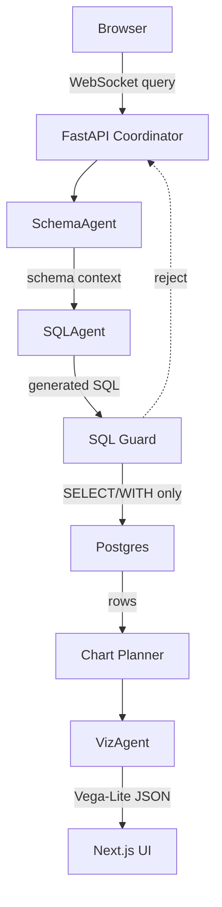

# NL2SQL Viz

Natural-language analytics for Postgres. Ask a business question, get a guarded SQL query, and inspect the result as a Vega-Lite chart.

## Demo

> _Screenshots and walkthrough video: TBD — to be added before public release._

```bash
# Ask in the UI
"Show monthly recurring revenue by plan tier over time."
# intent -> schema -> guarded SQL -> chart plan -> Vega-Lite render
```

## Stack

Python · FastAPI (async, WebSocket) · Claude via OpenRouter (SQL + chart agents) · PostgreSQL · Vega-Lite · Next.js 16 + TypeScript · Tailwind CSS · Argon2 (API key hashing) · AES-256-GCM (stored DSN encryption) · pytest · Docker Compose.

## Overview

NL2SQL Viz turns a database into an analyst-friendly interface. It inspects schema, generates read-only SQL, executes the query, streams status back to the browser, and renders a chart with the SQL visible for review.

## Demo Dataset

The bundled RavenStack dataset models a SaaS business with customer accounts, subscriptions, feature usage, support tickets, and churn events.

| Table             |   Rows | Example questions                                       |
| ----------------- | -----: | ------------------------------------------------------- |
| `accounts`        |    500 | Which referral sources produce the highest average ARR? |
| `subscriptions`   |  5,000 | Show monthly recurring revenue by plan tier over time.  |
| `feature_usage`   | 25,000 | Which features have high usage and high error counts?   |
| `support_tickets` |  2,000 | Show support volume and satisfaction by priority.       |
| `churn_events`    |    600 | Compare churn reasons by initial plan tier.             |

See [docs/ravenstack-demo.md](docs/ravenstack-demo.md) for the full walkthrough.

## How It Works



## Highlights

- Async FastAPI backend with WebSocket progress events
- NOOA agent classes (Schema, SQL, Viz, Coordinator) with typed Pydantic contracts
- LLM calls routed through OpenRouter via litellm
- Postgres connection pool with read-only execution guardrails
- Synthetic but realistic SaaS analytics dataset
- Vega-Lite chart rendering in a Next.js frontend
- Unit and integration tests around SQL generation, demo loading, chart planning, auth, and security

## Quick Start

```bash
cp .env.example .env
# Add OPENROUTER_API_KEY and SECRET_KEY

uv sync
docker compose up -d
uv run python -m scripts.load_ravenstack
uv run uvicorn app.main:app --reload --port 8000
```

In another terminal:

```bash
cd frontend
npm install
npm run dev
```

Open `http://localhost:3000`.

## Quality Checks

| Check              | Command                                    | Notes                          |
| ------------------ | ------------------------------------------ | ------------------------------ |
| Backend unit tests | `uv run pytest tests/unit -q`              | Does not require API keys      |
| Backend lint       | `uv run ruff check .`                      | Python style and import checks |
| Frontend typecheck | `cd frontend && npm run typecheck`         | TypeScript compile check       |
| Demo loader        | `uv run python -m scripts.load_ravenstack` | Requires local Postgres        |

Current validation:

| Check              | Result                                               |
| ------------------ | ---------------------------------------------------- |
| Unit tests         | 59 passed                                            |
| Integration tests  | 13 passed (requires local Postgres + OpenRouter key) |
| Ruff               | Passed                                               |
| Frontend typecheck | Passed                                               |

## Datasets

The app ships with bundled sample datasets (in `data/samples/`) plus real public datasets you can download. Large files are **not committed to the repo** — grab them from the links below and drop them into `data/samples/` (they're picked up automatically by the manifest).

| Dataset                       | Domain     |            Rows | Download                                                                                    |
| ----------------------------- | ---------- | --------------: | ------------------------------------------------------------------------------------------- |
| Online Retail II              | Retail     |         541,910 | [UCI](https://archive.ics.uci.edu/dataset/502/online+retail+ii)                             |
| Taiwanese Bankruptcy          | Finance    | 6,819 (96 cols) | [UCI](https://archive.ics.uci.edu/dataset/572/taiwanese+bankruptcy+prediction)              |
| Online Shoppers Intention     | Marketing  |          12,330 | [UCI](https://archive.ics.uci.edu/dataset/468/online+shoppers+purchasing+intention+dataset) |
| Telco Customer Churn          | Finance    |           7,043 | [Kaggle](https://www.kaggle.com/datasets/blastchar/telco-customer-churn)                    |
| Lending Club Loans            | Finance    |            2.2M | [Kaggle](https://www.kaggle.com/datasets/wordsforthewise/lending-club)                      |
| Olist Brazilian E-commerce    | Retail     |     100K orders | [Kaggle](https://www.kaggle.com/datasets/olistbr/brazilian-ecommerce)                       |
| Hospital Inpatient Discharges | Healthcare |            2.5M | [Kaggle](https://www.kaggle.com/datasets/rohitrox/hospital-inpatient-discharges)            |

To add a dataset: place the CSV in `data/samples/` and add an entry to `data/samples/manifest.json` (name, domain, description, questions). The upload pipeline handles up to **20M rows** via Postgres COPY.

## Safety Boundaries

- Only `SELECT` and `WITH` statements are allowed through the SQL guard.
- Multiple SQL statements are rejected.
- Mutating keywords such as `INSERT`, `UPDATE`, `DELETE`, `DROP`, and `ALTER` are blocked.
- API keys are hashed with Argon2.
- Stored database credentials use AES-256-GCM encryption.
- `.env`, local databases, private keys, virtualenvs, build output, and editor state are ignored.

## Repository Map

```text
app/
  agents/        # schema, SQL, chart, visualization, and coordinator logic
  connectors/    # Postgres connector and DB abstraction
  core/          # auth, demo session, SQL guard, security, session state
  execution/     # Bun sandbox for optional transform code execution
frontend/
  src/app/       # Next.js app shell
  src/components # query panel, event log, chart panel, SQL viewer
data/ravenstack/ # synthetic SaaS analytics CSVs
docs/            # demo notes
tests/           # unit, integration, and security tests
```

## Next Milestones

- Add a screenshot-driven demo walkthrough.
- Add saved queries and a connection wizard.
- Replace raw DSN browser messages with server-side `connection_id` references.
- Add benchmark cases for SQL validity, chart choice, and guardrail rejection.
