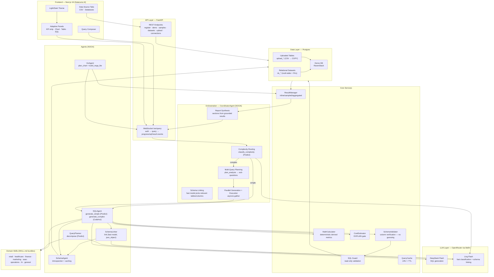

# NL2SQL Viz — System Architecture



## Key Flows

### 0. Schema grounding (every query)

```
Schema introspection → scope to active dataset (FK-connected graph of focus table)
→ SchemaLinker (fast model) picks relevant tables/columns → filter_to(linked)
→ SQL model generates against the small, correct context
```

### 1. Simple query (fast path)

```
Question → classify (Predict) → SIMPLE → generate_simple (Predict, ~10s)
→ SchemaValidator (verify columns) → SQL Guard → execute → grounded answer → chart
```

### 2. Very-complex query (multi-query + report)

```
Question → classify → COMPLEX → plan_analysis (sub-questions, ~3s)
→ generate each SQL in parallel → validate each (retry with feedback if wrong)
→ execute all in parallel → synthesize report sections → result
```

### 3. CSV upload

```
File → stream to temp → type inference → COPY into Postgres (upload_* table)
→ schema introspection picks it up → queryable via the same pipeline
```

### 4. Relational dataset load

```
schema.json (tables + FKs) → create tables with constraints → stream each CSV via COPY
→ question ladder (easy/medium/hard/very_complex) shown in UI
```

## Safety & Grounding

- **SQL Guard**: SELECT/WITH only, no mutating keywords, single statement
- **SchemaValidator**: every column verified against the real schema — wrong columns fixed or rejected with feedback (no guessing)
- **MathCalculator**: derived metrics computed deterministically, never by the LLM
- **Read-only transactions**: Postgres `transaction(readonly=True)` at execution
- **Cost gate**: EXPLAIN rejects queries estimated to scan > threshold rows
